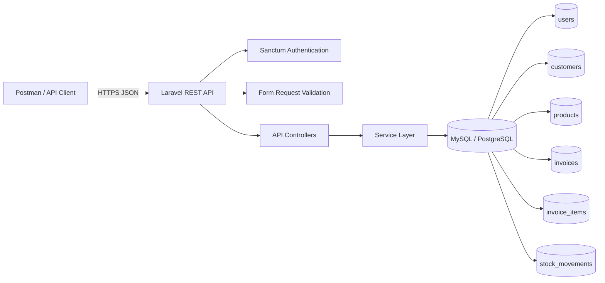

```mermaid

flowchart LR
    Client[Postman / API Client] -->|HTTPS JSON| Laravel[Laravel REST API]

    Laravel --> Auth[Sanctum Authentication]
    Laravel --> Validation[Form Request Validation]
    Laravel --> Controllers[API Controllers]
    Controllers --> Services[Service Layer]
    Services --> DB[(MySQL / PostgreSQL)]

    DB --> Users[(users)]
    DB --> Customers[(customers)]
    DB --> Products[(products)]
    DB --> Invoices[(invoices)]
    DB --> InvoiceItems[(invoice_items)]
    DB --> StockMovements[(stock_movements)]
```
