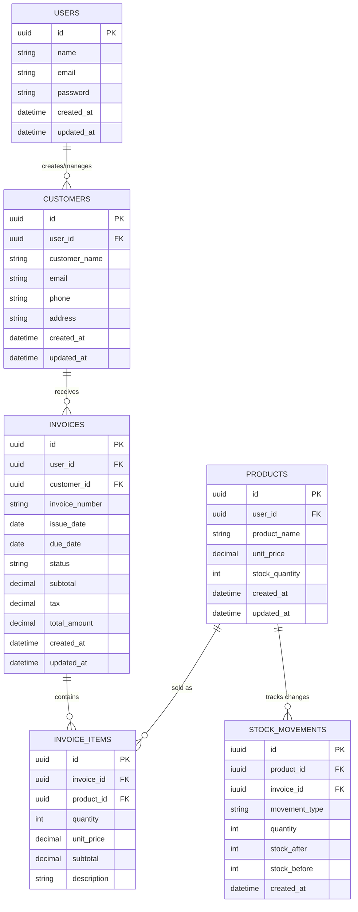

```mermaid
erDiagram
    USERS ||--o{ CUSTOMERS : "creates/manages"
    CUSTOMERS ||--o{ INVOICES : "receives"
    INVOICES ||--o{ INVOICE_ITEMS : "contains"
    PRODUCTS ||--o{ INVOICE_ITEMS : "sold as"
    PRODUCTS ||--o{ STOCK_MOVEMENTS : "tracks changes"

    USERS {
        uuid id PK
        string name
        string email
        string password
        datetime created_at
        datetime updated_at
    }

    CUSTOMERS {
        uuid id PK
        uuid user_id FK
        string customer_name
        string email
        string phone
        string address
        datetime created_at
        datetime updated_at
    }

    PRODUCTS {
        uuid id PK
        uuid user_id FK
        string product_name
        decimal unit_price
        int stock_quantity
        datetime created_at
        datetime updated_at
    }

    INVOICES {
        uuid id PK
        uuid user_id FK
        uuid customer_id FK
        string invoice_number
        date issue_date
        date due_date
        string status
        decimal subtotal
        decimal tax
        decimal total_amount
        datetime created_at
        datetime updated_at
    }

    INVOICE_ITEMS {
        uuid id PK
        uuid invoice_id FK
        uuid product_id FK
        int quantity
        decimal unit_price
        decimal subtotal
        string description
    }

    STOCK_MOVEMENTS {
        iuuid id PK
        iuuid product_id FK
        iuuid invoice_id FK
        string movement_type
        int quantity
        int stock_after
        int stock_before
        datetime created_at
    }
```