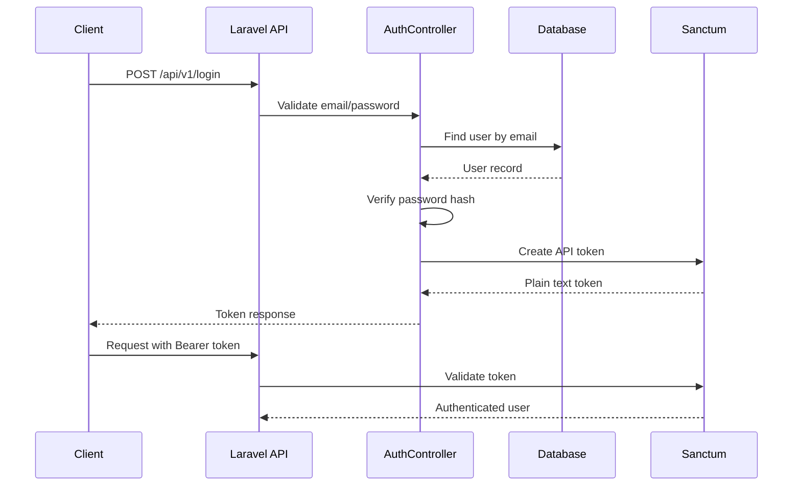

```mermaid
sequenceDiagram
    participant Client
    participant API as Laravel API
    participant Auth as AuthController
    participant DB as Database
    participant Sanctum

    Client->>API: POST /api/v1/login
    API->>Auth: Validate email/password
    Auth->>DB: Find user by email
    DB-->>Auth: User record
    Auth->>Auth: Verify password hash
    Auth->>Sanctum: Create API token
    Sanctum-->>Auth: Plain text token
    Auth-->>Client: Token response

    Client->>API: Request with Bearer token
    API->>Sanctum: Validate token
    Sanctum-->>API: Authenticated user
```