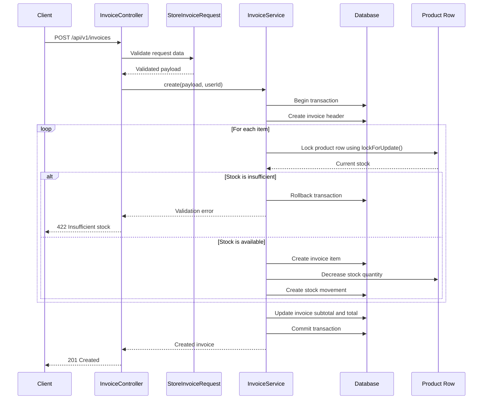

```mermaid
sequenceDiagram
    participant Client
    participant Controller as InvoiceController
    participant Request as StoreInvoiceRequest
    participant Service as InvoiceService
    participant DB as Database
    participant Product as Product Row

    Client->>Controller: POST /api/v1/invoices
    Controller->>Request: Validate request data
    Request-->>Controller: Validated payload

    Controller->>Service: create(payload, userId)
    Service->>DB: Begin transaction
    Service->>DB: Create invoice header

    loop For each item
        Service->>Product: Lock product row using lockForUpdate()
        Product-->>Service: Current stock

        alt Stock is insufficient
            Service->>DB: Rollback transaction
            Service-->>Controller: Validation error
            Controller-->>Client: 422 Insufficient stock
        else Stock is available
            Service->>DB: Create invoice item
            Service->>Product: Decrease stock quantity
            Service->>DB: Create stock movement
        end
    end

    Service->>DB: Update invoice subtotal and total
    Service->>DB: Commit transaction
    Service-->>Controller: Created invoice
    Controller-->>Client: 201 Created
```