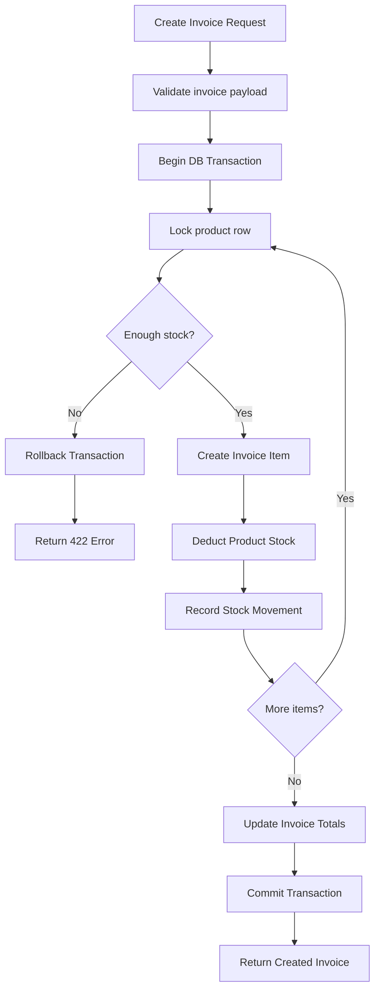

```mermaid
flowchart TD
    Start[Create Invoice Request] --> Validate[Validate invoice payload]
    Validate --> BeginTx[Begin DB Transaction]
    BeginTx --> LockProduct[Lock product row]
    LockProduct --> CheckStock{Enough stock?}

    CheckStock -- No --> Rollback[Rollback Transaction]
    Rollback --> Error[Return 422 Error]

    CheckStock -- Yes --> CreateItem[Create Invoice Item]
    CreateItem --> DeductStock[Deduct Product Stock]
    DeductStock --> RecordMovement[Record Stock Movement]
    RecordMovement --> MoreItems{More items?}

    MoreItems -- Yes --> LockProduct
    MoreItems -- No --> UpdateTotals[Update Invoice Totals]
    UpdateTotals --> Commit[Commit Transaction]
    Commit --> Success[Return Created Invoice]
```
