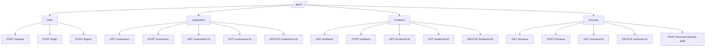

```mermaid
flowchart TD
    API[/api/v1/] --> Auth[Auth]
    API --> Customers[Customers]
    API --> Products[Products]
    API --> Invoices[Invoices]

    Auth --> Register[POST /register]
    Auth --> Login[POST /login]
    Auth --> Logout[POST /logout]

    Customers --> ListCustomers[GET /customers]
    Customers --> CreateCustomer[POST /customers]
    Customers --> ShowCustomer[GET /customers/:id]
    Customers --> UpdateCustomer[PUT /customers/:id]
    Customers --> DeleteCustomer[DELETE /customers/:id]

    Products --> ListProducts[GET /products]
    Products --> CreateProduct[POST /products]
    Products --> ShowProduct[GET /products/:id]
    Products --> UpdateProduct[PUT /products/:id]
    Products --> DeleteProduct[DELETE /products/:id]

    Invoices --> ListInvoices[GET /invoices]
    Invoices --> CreateInvoice[POST /invoices]
    Invoices --> ShowInvoice[GET /invoices/:id]
    Invoices --> DeleteInvoice[DELETE /invoices/:id]
    Invoices --> MarkPaid[POST /invoices/:id/mark-paid]
```