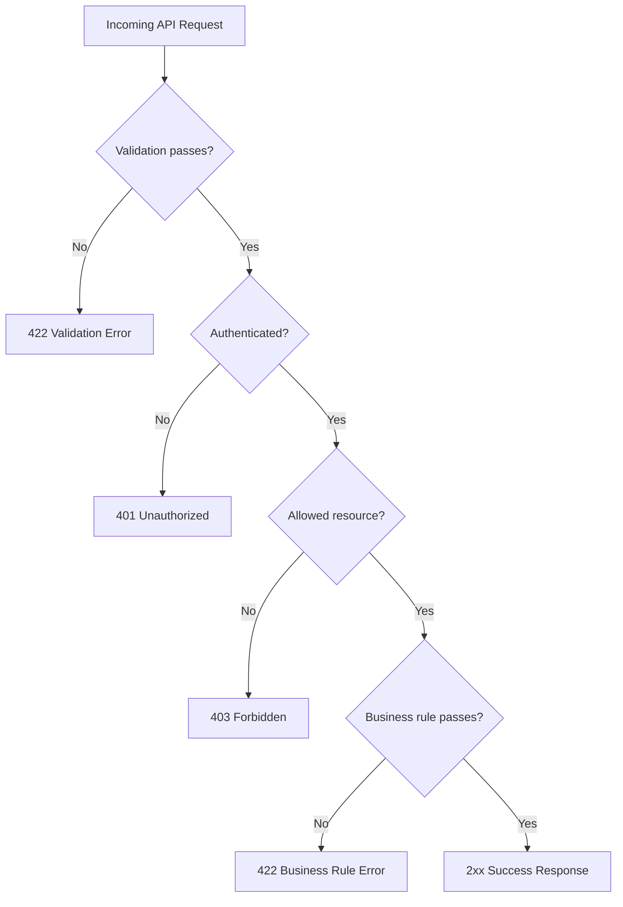

```mermaid
flowchart TD
    Request[Incoming API Request] --> Validation{Validation passes?}

    Validation -- No --> ValidationError[422 Validation Error]

    Validation -- Yes --> AuthCheck{Authenticated?}
    AuthCheck -- No --> Unauthorized[401 Unauthorized]

    AuthCheck -- Yes --> PermissionCheck{Allowed resource?}
    PermissionCheck -- No --> Forbidden[403 Forbidden]

    PermissionCheck -- Yes --> BusinessRule{Business rule passes?}
    BusinessRule -- No --> DomainError[422 Business Rule Error]

    BusinessRule -- Yes --> Success[2xx Success Response]
```